# Taxodo AI – Ultra Deep AWS Architecture Design Document

## Cloud-Native, AI-First Financial Copilot — Complete System Design

## Table of Contents

1. [System Overview](#1-system-overview)
2. [Core Architecture Philosophy](#2-core-architecture-philosophy)
3. [High-Level System Architecture](#3-high-level-system-architecture)
4. [Detailed AWS Service Architecture](#4-detailed-aws-service-architecture)
5. [VPC & Networking Architecture](#5-vpc--networking-architecture)
6. [Document Intelligence Pipeline](#6-document-intelligence-pipeline-textract--ai)
7. [Microservices Architecture (Domain-Driven)](#7-microservices-architecture-domain-driven)
8. [RAG Architecture (OpenSearch + Bedrock)](#8-rag-architecture-opensearch--bedrock)
9. [Tax Engine Real-Time Computation Flow](#9-tax-engine-real-time-computation-flow)
10. [Data Storage Architecture](#10-data-storage-architecture)
11. [Security Architecture (Fintech-Grade)](#11-security-architecture-fintech-grade)
12. [Async Processing & Workflow Orchestration](#12-async-processing--workflow-orchestration)
13. [DevOps & CI/CD Architecture](#13-devops--cicd-architecture)
14. [Scalability & Performance Strategy](#14-scalability--performance-strategy)
15. [Multi-Tenant SaaS Design](#15-multi-tenant-saas-design)
16. [Observability & Monitoring](#16-observability--monitoring)
17. [Database Schema Design](#17-database-schema-design)
18. [API Gateway Design](#18-api-gateway-design)
19. [AI/ML Pipeline Design](#19-aiml-pipeline-design)
20. [Disaster Recovery & Business Continuity](#20-disaster-recovery--business-continuity)
21. [Cost Architecture & Optimization](#21-cost-architecture--optimization)
22. [Deployment Architecture](#22-deployment-architecture)
23. [Future Architecture Enhancements](#23-future-architecture-enhancements)
24. [Architecture Decision Records (ADRs)](#24-architecture-decision-records-adrs)
25. [Final Architecture Summary](#25-final-architecture-summary)

---

## 1. System Overview

Taxodo AI is a cloud-native, AI-first financial copilot built for Indian SMEs to automate document ingestion, bookkeeping, tax intelligence (GST + Income Tax), and AI-driven financial advisory using a Retrieval-Augmented Generation (RAG) architecture on AWS.

The platform is designed as a **multi-tenant SaaS system** with real-time dashboards, AI copilots, and event-driven microservices running on AWS managed services.

### 1.1 Architecture Highlights

| Aspect | Technology Choice |
|--------|------------------|
| **Compute** | ECS Fargate (containers) + Lambda (serverless) |
| **AI/ML** | Amazon Bedrock (LLM) + Textract (OCR) |
| **Data** | RDS PostgreSQL + OpenSearch + S3 + Redis |
| **Messaging** | SQS + EventBridge + Step Functions |
| **Security** | Cognito + KMS + WAF + Shield |
| **Networking** | VPC + ALB + CloudFront + API Gateway |
| **Observability** | CloudWatch + X-Ray + CloudTrail |
| **CI/CD** | CodePipeline + CodeBuild + ECR |

### 1.2 Key Design Decisions

1. **ECS Fargate over EKS** – Simpler container orchestration, lower operational overhead for initial scale
2. **Amazon Bedrock over SageMaker** – Managed LLM inference, no model hosting complexity
3. **OpenSearch over Pinecone** – AWS-native vector DB, single cloud vendor strategy
4. **PostgreSQL over DynamoDB** – Complex financial queries, ACID transactions, relational integrity
5. **Event-driven over synchronous** – Loose coupling, async document processing, scalability

---

## 2. Core Architecture Philosophy

### 2.1 Guiding Principles

| Principle | Description | Implementation |
|-----------|-------------|---------------|
| **Cloud-Native** | AWS managed services, no self-managed infrastructure | ECS Fargate, RDS, S3, Bedrock |
| **AI-First Design** | Every feature leverages AI where value is added | OCR → LLM structuring → RAG advisory |
| **Event-Driven Pipelines** | Async processing, loose coupling between services | SQS, EventBridge, Step Functions |
| **Microservices Architecture** | Independent, deployable services per domain | 6 domain services on ECS |
| **Fintech-Grade Security** | Encryption everywhere, audit everything | KMS, WAF, CloudTrail, VPC isolation |
| **Multi-Device Access** | Web + Mobile + Tablet responsive | CloudFront + PWA |
| **RAG-Based Intelligence** | AI grounded in user's actual financial data | OpenSearch vectors + RDS structured data |

### 2.2 Architecture Patterns Used

```
├── Microservices Pattern        → Domain-driven service decomposition
├── Event Sourcing (Partial)     → Financial event tracking
├── CQRS (Partial)               → Separate read (cache) / write (DB) paths
├── Saga Pattern                 → Multi-step document processing
├── API Gateway Pattern          → Centralized API management
├── Strangler Fig (Future)       → Gradual migration to serverless
├── Circuit Breaker              → Resilient external service calls
├── Sidecar (Future)             → Service mesh for observability
└── RAG Pattern                  → Retrieval-augmented AI responses
```

---

## 3. High-Level System Architecture

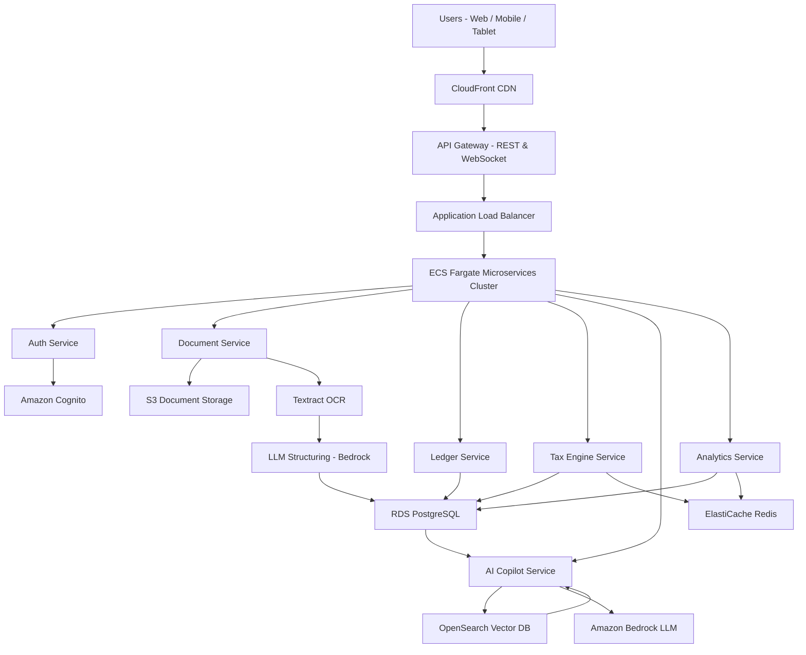

### 3.1 Architecture Layers

```
┌─────────────────────────────────────────────────────────────────┐
│                    PRESENTATION LAYER                           │
│  CloudFront CDN → S3 Static Hosting (React/Next.js Dashboard)  │
├─────────────────────────────────────────────────────────────────┤
│                    API LAYER                                    │
│  API Gateway (REST + WebSocket) → Route 53 (DNS)               │
├─────────────────────────────────────────────────────────────────┤
│                    APPLICATION LAYER                            │
│  ALB → ECS Fargate (6 Microservices) + Lambda (Workers)        │
├─────────────────────────────────────────────────────────────────┤
│                    AI/ML LAYER                                  │
│  Bedrock (LLM) + Textract (OCR) + OpenSearch (Vector DB)       │
├─────────────────────────────────────────────────────────────────┤
│                    DATA LAYER                                   │
│  RDS PostgreSQL + S3 + ElastiCache Redis + DynamoDB (optional) │
├─────────────────────────────────────────────────────────────────┤
│                    MESSAGING LAYER                              │
│  SQS + EventBridge + Step Functions                            │
├─────────────────────────────────────────────────────────────────┤
│                    SECURITY LAYER                               │
│  Cognito + KMS + WAF + Shield + IAM + Secrets Manager          │
├─────────────────────────────────────────────────────────────────┤
│                    INFRASTRUCTURE LAYER                         │
│  VPC + Subnets + Security Groups + NAT + CloudWatch + X-Ray    │
└─────────────────────────────────────────────────────────────────┘
```

---

## 4. Detailed AWS Service Architecture

### 4.1 Frontend Layer

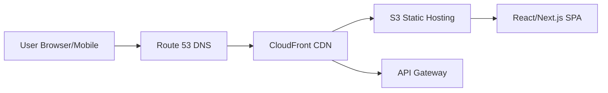

| AWS Service | Purpose | Configuration |
|-------------|---------|---------------|
| **Amazon S3** | Static website hosting | Versioning enabled, lifecycle policies |
| **Amazon CloudFront** | CDN with edge caching | HTTP/2, Brotli compression, custom error pages |
| **Route 53** | DNS management | Health checks, failover routing |
| **AWS Amplify** | CI/CD for frontend (optional) | Git-based deployment pipeline |
| **AWS Certificate Manager** | SSL/TLS certificates | Auto-renewal, CloudFront integration |

**CloudFront Configuration:**
```
Distribution:
  Origins:
    - S3 (static assets) → default behavior
    - API Gateway (APIs) → /api/* path pattern
  Cache Policies:
    - Static assets: 1 year TTL
    - API responses: No cache (pass-through)
  Security:
    - HTTPS only
    - Custom SSL certificate (ACM)
    - Geo-restriction: None (global access)
    - WAF integration: Enabled
```

**Frontend Responsibilities:**
- Multi-device responsive dashboard (React/Next.js)
- AI chat interface (conversational UI)
- Financial analytics visualization (Chart.js/Recharts)
- Secure document upload (pre-signed S3 URLs)
- Real-time updates via WebSocket
- Service Worker for PWA offline capability

### 4.2 API Layer

| Component | Purpose | Configuration |
|-----------|---------|---------------|
| **API Gateway (REST)** | RESTful API management | Regional endpoint, API keys, usage plans |
| **API Gateway (WebSocket)** | Real-time push updates | Routes: $connect, $disconnect, $default |
| **Application Load Balancer** | ECS service routing | Path-based routing, health checks |
| **AWS WAF** | API protection | Rate limiting, SQL injection protection |

**API Gateway Configuration:**
```
REST API:
  Stages: dev, staging, prod
  Authorization: Cognito User Pool Authorizer
  Throttling: 1000 requests/second (burst), 500 steady-state
  Per-User Rate Limit: 100 requests/minute
  CORS: Enabled for dashboard origins
  Request Validation: Enabled
  Logging: CloudWatch access logs

WebSocket API:
  Routes:
    $connect → Connection handler (Lambda)
    $disconnect → Cleanup handler (Lambda)
    sendMessage → Message router (Lambda → ECS)
  Authorization: Cognito token on $connect
```

### 4.3 Compute Layer

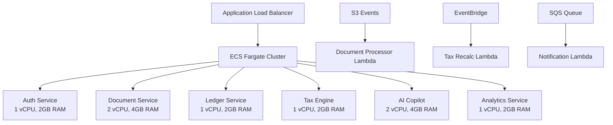

**ECS Fargate Service Configuration:**

| Service | vCPU | Memory | Min Tasks | Max Tasks | Scaling Metric |
|---------|:----:|:------:|:---------:|:---------:|----------------|
| Auth Service | 0.5 | 1 GB | 2 | 8 | CPU > 70% |
| Document Service | 1 | 2 GB | 2 | 20 | SQS queue depth |
| Ledger Service | 0.5 | 1 GB | 2 | 10 | CPU > 70% |
| Tax Engine | 0.5 | 1 GB | 2 | 10 | CPU > 70% |
| AI Copilot | 1 | 2 GB | 2 | 15 | Request count |
| Analytics Service | 0.5 | 1 GB | 2 | 8 | CPU > 70% |

**Lambda Functions:**

| Function | Runtime | Memory | Timeout | Trigger |
|----------|---------|:------:|:-------:|---------|
| Document Processor | Python 3.12 | 512 MB | 5 min | S3 event → SQS |
| Tax Recalculator | Python 3.12 | 256 MB | 30 sec | EventBridge |
| Notification Sender | Python 3.12 | 128 MB | 10 sec | SQS/SNS |
| WebSocket Handler | Node.js 20 | 128 MB | 10 sec | API Gateway WS |
| Pre-signed URL Gen | Python 3.12 | 128 MB | 5 sec | API Gateway |

---

## 5. VPC & Networking Architecture

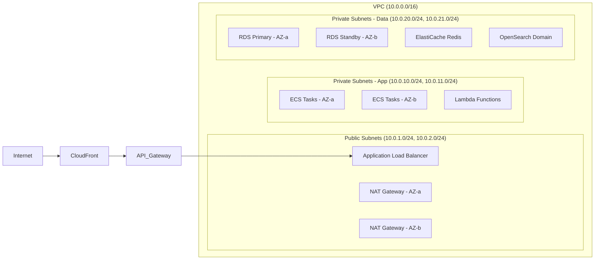

### 5.1 VPC Design Details

```
VPC CIDR: 10.0.0.0/16 (65,536 IPs)

Availability Zones: 2 (ap-south-1a, ap-south-1b)

Subnet Layout:
┌─────────────────────────────────────────────────────────┐
│                     VPC (10.0.0.0/16)                   │
│                                                         │
│  ┌──────────────────┐  ┌──────────────────┐            │
│  │ Public Subnet AZ-a│  │ Public Subnet AZ-b│          │
│  │ 10.0.1.0/24      │  │ 10.0.2.0/24      │          │
│  │ • ALB             │  │ • ALB             │          │
│  │ • NAT Gateway     │  │ • NAT Gateway     │          │
│  └──────────────────┘  └──────────────────┘            │
│                                                         │
│  ┌──────────────────┐  ┌──────────────────┐            │
│  │ Private App AZ-a │  │ Private App AZ-b │            │
│  │ 10.0.10.0/24     │  │ 10.0.11.0/24     │            │
│  │ • ECS Tasks       │  │ • ECS Tasks       │          │
│  │ • Lambda          │  │ • Lambda          │            │
│  └──────────────────┘  └──────────────────┘            │
│                                                         │
│  ┌──────────────────┐  ┌──────────────────┐            │
│  │ Private Data AZ-a│  │ Private Data AZ-b│            │
│  │ 10.0.20.0/24     │  │ 10.0.21.0/24     │            │
│  │ • RDS Primary     │  │ • RDS Standby     │          │
│  │ • Redis Primary   │  │ • Redis Replica   │          │
│  │ • OpenSearch      │  │ • OpenSearch      │            │
│  └──────────────────┘  └──────────────────┘            │
└─────────────────────────────────────────────────────────┘
```

### 5.2 Security Groups

| Security Group | Inbound Rules | Outbound Rules |
|---------------|---------------|----------------|
| **SG-ALB** | 443 from 0.0.0.0/0 | All to SG-ECS |
| **SG-ECS** | 8080 from SG-ALB | All to SG-Data, SG-Cache |
| **SG-RDS** | 5432 from SG-ECS | None (DB initiated) |
| **SG-Redis** | 6379 from SG-ECS | None |
| **SG-OpenSearch** | 443 from SG-ECS | None |
| **SG-Lambda** | N/A (VPC Lambda) | All to SG-Data, Internet via NAT |

### 5.3 VPC Endpoints (Private Connectivity)

| Endpoint | Type | Service |
|----------|------|---------|
| S3 Gateway | Gateway | com.amazonaws.ap-south-1.s3 |
| DynamoDB Gateway | Gateway | com.amazonaws.ap-south-1.dynamodb |
| ECR API | Interface | com.amazonaws.ap-south-1.ecr.api |
| ECR Docker | Interface | com.amazonaws.ap-south-1.ecr.dkr |
| CloudWatch Logs | Interface | com.amazonaws.ap-south-1.logs |
| Secrets Manager | Interface | com.amazonaws.ap-south-1.secretsmanager |
| Bedrock | Interface | com.amazonaws.ap-south-1.bedrock-runtime |
| SQS | Interface | com.amazonaws.ap-south-1.sqs |

---

## 6. Document Intelligence Pipeline (Textract + AI)

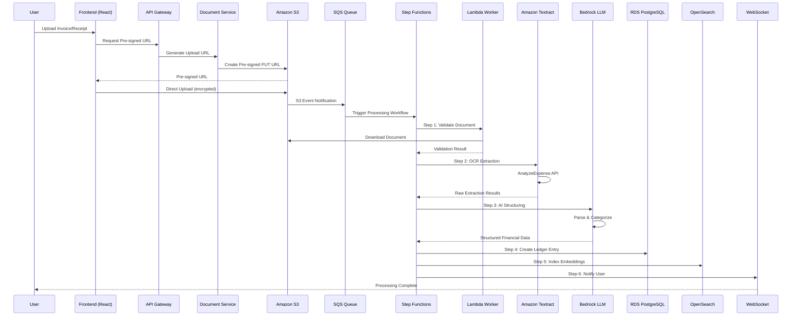

### 6.1 Step Functions State Machine

```
DocumentProcessingStateMachine:
  States:
    1. ValidateDocument
       - Check file type, size, format
       - Error → FailedValidation (DLQ)
    
    2. ExtractWithTextract
       - Call AnalyzeExpense API
       - Async job (wait for callback)
       - Error → RetryTextract (max 3)
    
    3. StructureWithBedrock
       - Send raw OCR to Bedrock LLM
       - Prompt: "Extract vendor, GSTIN, items, amounts, taxes"
       - Validate response schema
       - Error → ManualReviewQueue
    
    4. DuplicateCheck
       - Check for existing document (hash + metadata)
       - Duplicate → NotifyUserDuplicate
    
    5. CreateLedgerEntry
       - Insert into RDS (transaction)
       - Update financial summaries
    
    6. GenerateEmbeddings
       - Create text embedding (Bedrock Titan)
       - Index in OpenSearch
    
    7. TriggerTaxRecalc
       - Emit EventBridge event
       - Tax engine recalculates
    
    8. NotifyUser
       - WebSocket push notification
       - Email notification (SES)
    
    ErrorHandling:
      - RetryTextract: Max 3 retries with backoff
      - ManualReviewQueue: SQS DLQ for failed AI parsing
      - FailedValidation: Notify user, log error
```

### 6.2 Textract Configuration

```
AnalyzeExpense API Call:
  Document:
    S3Object:
      Bucket: taxodo-documents-{env}
      Name: {tenant_id}/{document_id}/{filename}
  
  Expected Extraction:
    - VendorName
    - VendorAddress  
    - InvoiceNumber
    - InvoiceDate
    - Total
    - Tax (CGST, SGST, IGST breakdown)
    - LineItems (Description, Qty, UnitPrice, Amount)
    - GSTIN
    - PaymentTerms

  Post-Processing:
    - Confidence score filtering (> 80%)
    - GSTIN format validation (regex)
    - Amount reconciliation (items total = grand total)
    - Currency normalization (₹/INR)
```

### 6.3 Bedrock LLM Structuring Prompt

```
System: You are a financial document parser for Indian businesses.
Given OCR-extracted text from an invoice/receipt, extract and return 
a structured JSON with the following fields:

{
  "document_type": "sales_invoice|purchase_invoice|expense_receipt|credit_note",
  "vendor": { "name": "", "gstin": "", "address": "" },
  "invoice_number": "",
  "invoice_date": "YYYY-MM-DD",
  "line_items": [
    { "description": "", "hsn_sac": "", "quantity": 0, "rate": 0, "amount": 0 }
  ],
  "tax_details": {
    "cgst_rate": 0, "cgst_amount": 0,
    "sgst_rate": 0, "sgst_amount": 0,
    "igst_rate": 0, "igst_amount": 0,
    "cess": 0
  },
  "total_amount": 0,
  "category": "raw_material|office|travel|salary|utilities|other",
  "confidence": 0.0
}

Rules:
- All amounts in INR (₹)
- Validate GSTIN format: 2-digit state + 10-char PAN + 1-digit entity + 1-check
- If unsure about a field, set confidence < 0.7
- Categorize expenses based on line item descriptions
```

---

## 7. Microservices Architecture (Domain-Driven)

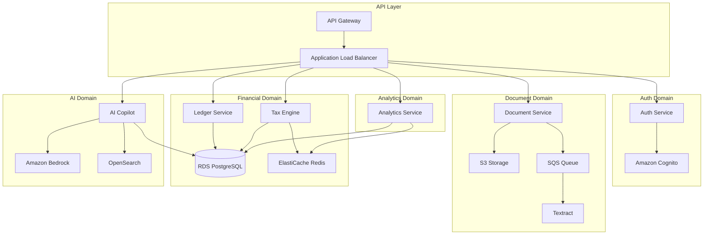

### 7.1 Service Specifications

| Service | Responsibility | Tech Stack | AWS Compute | Port |
|---------|---------------|------------|-------------|:----:|
| **Auth Service** | User authentication, RBAC, session management | Python FastAPI | ECS Fargate | 8001 |
| **Document Service** | Upload, OCR pipeline, document management | Python FastAPI | ECS + Lambda | 8002 |
| **Ledger Service** | Bookkeeping, transactions, financial records | Python FastAPI | ECS Fargate | 8003 |
| **Tax Engine** | GST & Income Tax calculations, forecasting | Python FastAPI | ECS Fargate | 8004 |
| **AI Copilot** | RAG financial advisor, conversational AI | Python FastAPI | ECS Fargate | 8005 |
| **Analytics Service** | KPIs, dashboards, reporting | Python FastAPI | ECS Fargate | 8006 |

### 7.2 Inter-Service Communication

```
Communication Patterns:
┌─────────────────────────────────────────────┐
│ Synchronous (REST):                         │
│   • Auth → Cognito (token validation)       │
│   • Copilot → Ledger (financial data query) │
│   • Analytics → Ledger (KPI computation)    │
│   • Tax → Ledger (transaction data)         │
│                                             │
│ Asynchronous (Events):                      │
│   • Document → [SQS] → Document Workers     │
│   • Ledger → [EventBridge] → Tax Engine     │
│   • Tax → [WebSocket] → Dashboard           │
│   • Document → [EventBridge] → Ledger       │
│                                             │
│ Service Discovery:                          │
│   • AWS Cloud Map (Service Connect)         │
│   • ALB path-based routing as fallback      │
└─────────────────────────────────────────────┘
```

### 7.3 ALB Routing Rules

| Path Pattern | Target Service | Health Check |
|-------------|---------------|:-----------:|
| `/api/auth/*` | Auth Service (TG) | `/api/auth/health` |
| `/api/documents/*` | Document Service (TG) | `/api/documents/health` |
| `/api/ledger/*` | Ledger Service (TG) | `/api/ledger/health` |
| `/api/tax/*` | Tax Engine (TG) | `/api/tax/health` |
| `/api/copilot/*` | AI Copilot (TG) | `/api/copilot/health` |
| `/api/analytics/*` | Analytics Service (TG) | `/api/analytics/health` |

### 7.4 Service Contract Example (Document Service)

```python
# Document Service API Contract
class DocumentUploadRequest:
    file_name: str          # Original filename
    file_type: str          # MIME type (application/pdf, image/jpeg)
    file_size: int          # Size in bytes
    document_type: str      # Optional: invoice, receipt, etc.

class DocumentUploadResponse:
    document_id: str        # UUID
    upload_url: str         # Pre-signed S3 URL
    expires_in: int         # URL expiry in seconds

class DocumentStatusResponse:
    document_id: str
    status: str             # uploaded, processing, completed, failed
    extracted_data: dict    # Structured financial data (when completed)
    confidence: float       # AI extraction confidence score
    created_at: datetime
    processed_at: datetime
```

---

## 8. RAG Architecture (OpenSearch + Bedrock)

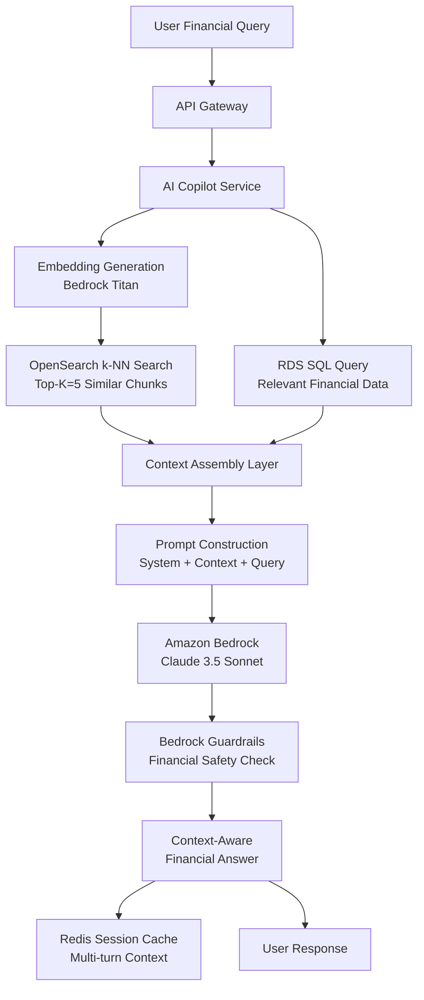

### 8.1 RAG Pipeline Deep Dive

```
RAG Query Processing Pipeline:
═══════════════════════════════

Step 1: Query Understanding
  ├── Parse user intent (financial question)
  ├── Extract entities (dates, amounts, categories)
  ├── Determine query type (factual, analytical, advisory)
  └── Generate search query variations

Step 2: Hybrid Retrieval
  ├── Vector Search (Semantic):
  │   ├── Embed query → Bedrock Titan Embedding (1024 dims)
  │   ├── k-NN search in OpenSearch (Top-K=5)
  │   ├── Filter by tenant_id (security)
  │   └── Return relevant document chunks + scores
  │
  └── Structured Query (SQL):
      ├── Generate SQL from query intent
      ├── Query RDS for financial summaries
      ├── Aggregate relevant transactions
      └── Return structured financial data

Step 3: Context Assembly
  ├── Merge vector results + SQL results
  ├── Rank by relevance score
  ├── Apply token budget (max 3000 tokens context)
  ├── Format context with source attribution
  └── Build final context string

Step 4: LLM Inference
  ├── Construct prompt:
  │   ├── System: Financial advisor persona
  │   ├── Context: Retrieved financial data
  │   ├── History: Previous conversation turns
  │   └── Query: User's current question
  ├── Call Bedrock (Claude 3.5 Sonnet)
  ├── Temperature: 0.3 (factual responses)
  ├── Max tokens: 1024 (response)
  └── Apply Bedrock Guardrails

Step 5: Response Post-Processing
  ├── Validate financial figures against context
  ├── Add source attribution
  ├── Format currency (₹ formatting)
  ├── Cache conversation in Redis
  └── Return response to user
```

### 8.2 OpenSearch Vector Index Configuration

```json
{
  "settings": {
    "index": {
      "knn": true,
      "knn.algo_param.ef_search": 100,
      "number_of_shards": 2,
      "number_of_replicas": 1
    }
  },
  "mappings": {
    "properties": {
      "tenant_id": { "type": "keyword" },
      "document_id": { "type": "keyword" },
      "chunk_id": { "type": "keyword" },
      "chunk_text": { "type": "text" },
      "embedding": {
        "type": "knn_vector",
        "dimension": 1024,
        "method": {
          "name": "hnsw",
          "engine": "nmslib",
          "space_type": "cosinesimil",
          "parameters": {
            "ef_construction": 256,
            "m": 16
          }
        }
      },
      "metadata": {
        "type": "object",
        "properties": {
          "document_type": { "type": "keyword" },
          "vendor_name": { "type": "text" },
          "amount": { "type": "float" },
          "date": { "type": "date" },
          "category": { "type": "keyword" }
        }
      },
      "created_at": { "type": "date" }
    }
  }
}
```

### 8.3 Embedding Strategy

| Aspect | Decision |
|--------|----------|
| **Model** | Bedrock Titan Embedding v2 (1024 dimensions) |
| **Chunk Size** | 500-800 tokens per chunk |
| **Overlap** | 100 tokens between chunks |
| **Chunking Strategy** | Sentence-aware splitting |
| **Metadata Enrichment** | Document type, vendor, amount, date |
| **Re-indexing** | On document update/correction |
| **Tenant Isolation** | `tenant_id` filter on all queries |

---

## 9. Tax Engine Real-Time Computation Flow

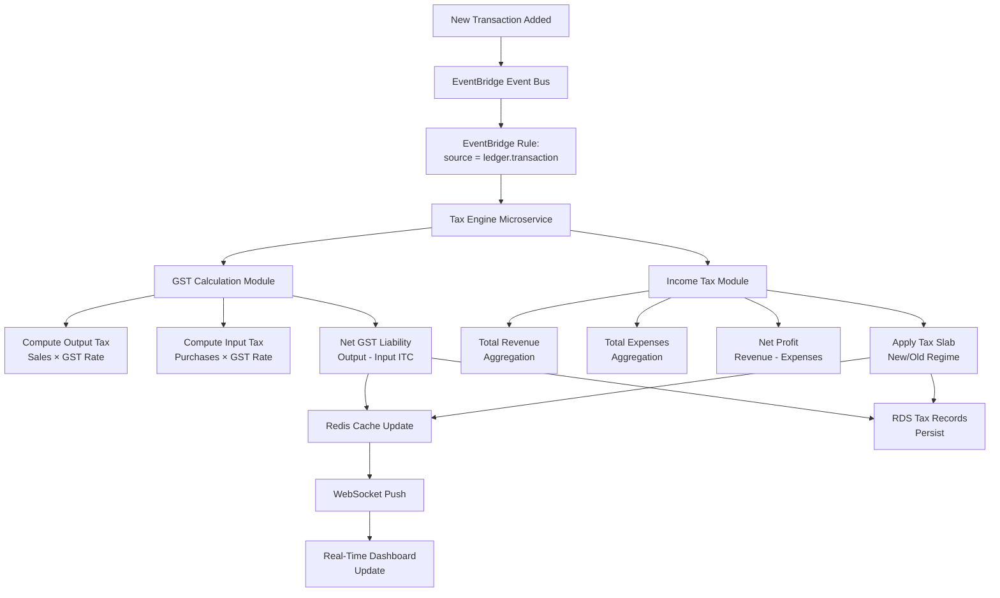

### 9.1 GST Calculation Engine

```
GST Calculation Logic:
══════════════════════

For each transaction:
  1. Determine transaction type:
     - Intra-state → CGST + SGST
     - Inter-state → IGST
     - Export → Zero-rated

  2. Determine applicable GST rate:
     - Lookup HSN/SAC code → rate mapping
     - Standard rates: 0%, 5%, 12%, 18%, 28%
     - Cess: Applicable on specific goods

  3. Calculate output tax (sales):
     Output_CGST = Taxable_Value × (GST_Rate / 2)
     Output_SGST = Taxable_Value × (GST_Rate / 2)
     OR
     Output_IGST = Taxable_Value × GST_Rate

  4. Calculate input tax credit (purchases):
     ITC_CGST = Purchase_CGST (if valid invoice + GSTIN)
     ITC_SGST = Purchase_SGST (if valid invoice + GSTIN)
     ITC_IGST = Purchase_IGST (if valid invoice + GSTIN)

  5. Net liability:
     Net_CGST = Output_CGST - ITC_CGST - ITC_IGST_utilized_for_CGST
     Net_SGST = Output_SGST - ITC_SGST - ITC_IGST_utilized_for_SGST
     Net_IGST = Output_IGST - ITC_IGST

  6. ITC Utilization Order (as per GST law):
     IGST → IGST liability → CGST liability → SGST liability
     CGST → CGST liability only
     SGST → SGST liability only
```

### 9.2 Income Tax Estimation Engine

```
Income Tax Calculation (FY 2025-26):
════════════════════════════════════

New Regime (Default):
  Slab          Rate
  0 - 3,00,000     0%
  3,00,001 - 7,00,000   5%
  7,00,001 - 10,00,000  10%
  10,00,001 - 12,00,000 15%
  12,00,001 - 15,00,000 20%
  Above 15,00,000       30%
  + 4% Health & Education Cess
  + Surcharge (if applicable)

Old Regime (Optional):
  Slab          Rate
  0 - 2,50,000     0%
  2,50,001 - 5,00,000   5%
  5,00,001 - 10,00,000  20%
  Above 10,00,000       30%
  + Deductions (80C, 80D, etc.)
  + 4% Cess

Presumptive Taxation (Sec 44AD):
  Applicable if: Turnover < ₹2 Crore (₹3 Cr if digital receipts > 95%)
  Deemed profit: 8% of turnover (6% for digital receipts)
  Tax on deemed profit using applicable slab

Advance Tax:
  Due dates: Jun 15 (15%), Sep 15 (45%), Dec 15 (75%), Mar 15 (100%)
  Alert: Trigger 15 days before each due date
  Calculation: Based on projected annual tax liability
```

### 9.3 Scenario Simulation Engine

```
Simulation Types:
  1. "What if I make a ₹X purchase?"
     → Recalculate with additional purchase
     → Show ITC impact on GST liability
     → Show depreciation impact on income tax

  2. "What if I opt for old tax regime?"
     → Compare both regimes with current data
     → Factor in available deductions
     → Recommend optimal regime

  3. "Project my tax for next quarter"
     → Trend analysis on revenue/expenses
     → Seasonal adjustment factors
     → Projected tax liability range
```

---

## 10. Data Storage Architecture

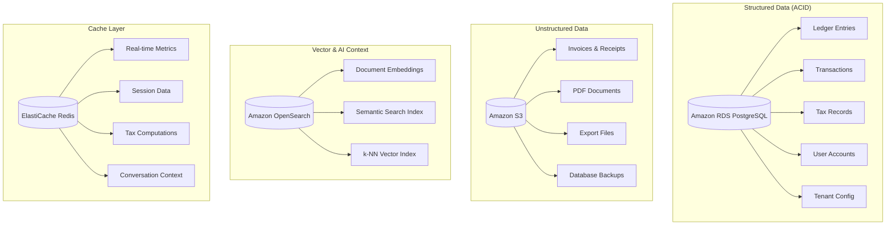

### 10.1 RDS PostgreSQL Configuration

```
Instance Class: db.r6g.large (2 vCPU, 16GB RAM)
Engine: PostgreSQL 16
Deployment: Multi-AZ (Primary + Standby)
Storage: gp3, 100 GB (auto-scaling to 500 GB)
IOPS: 3000 baseline (scales with storage)
Encryption: KMS (AES-256)
Backup: Automated daily, 30-day retention
PITR: Enabled (5-minute RPO)
Connection Pooling: PgBouncer (managed via RDS Proxy)

Extensions:
  - pg_trgm (text similarity)
  - uuid-ossp (UUID generation)
  - pgcrypto (encryption functions)
  - btree_gin (composite indexes)

Row-Level Security:
  CREATE POLICY tenant_isolation ON ledger_entries
    USING (tenant_id = current_setting('app.tenant_id')::uuid);
```

### 10.2 S3 Bucket Architecture

```
Bucket Structure:
taxodo-{env}-documents/
├── {tenant_id}/
│   ├── uploads/           # Raw uploaded files
│   │   ├── {doc_id}/
│   │   │   └── invoice.pdf
│   ├── processed/         # Textract results
│   │   ├── {doc_id}/
│   │   │   ├── ocr-result.json
│   │   │   └── structured-data.json
│   └── exports/           # User exports
│       ├── reports/
│       └── backups/

taxodo-{env}-static/
├── frontend/              # React/Next.js build
│   ├── index.html
│   ├── static/
│   └── assets/

Lifecycle Policies:
  - uploads/ → Glacier after 90 days
  - processed/ → Glacier after 180 days
  - exports/ → Delete after 30 days

Encryption: SSE-KMS (default)
Versioning: Enabled on documents bucket
CORS: Configured for frontend origin
```

### 10.3 ElastiCache Redis Configuration

```
Cluster Mode: Disabled (single shard)
Node Type: cache.r6g.large (13.5 GB)
Nodes: 1 Primary + 1 Replica (Multi-AZ)
Engine: Redis 7.x
Encryption: In-transit + at-rest (KMS)

Key Patterns:
  tenant:{tenant_id}:gst:summary      → GST liability cache (TTL: 5 min)
  tenant:{tenant_id}:tax:income        → Income tax estimate (TTL: 5 min)
  tenant:{tenant_id}:dashboard:kpis    → Dashboard KPIs (TTL: 1 min)
  session:{session_id}                 → User session (TTL: 30 min)
  conversation:{tenant_id}:{conv_id}  → AI conversation (TTL: 1 hour)
  rate_limit:{user_id}                → API rate limiting (TTL: 1 min)

Eviction Policy: allkeys-lru
Max Memory: 80% of available
```

### 10.4 OpenSearch Configuration

```
Domain: taxodo-{env}-search
Instance: t3.medium.search (2 nodes)
Storage: 100 GB gp3 per node
Engine: OpenSearch 2.x
k-NN Plugin: Enabled
Encryption: KMS at-rest + TLS in-transit
VPC Access: Private subnet only

Indices:
  - taxodo-documents    → Document chunks + embeddings
  - taxodo-transactions → Transaction search index
  
Index Lifecycle:
  - Hot: 30 days (fast SSD)
  - Warm: 90 days (cost-optimized)
  - Delete: 365 days (archived to S3)
```

---

## 11. Security Architecture (Fintech-Grade)

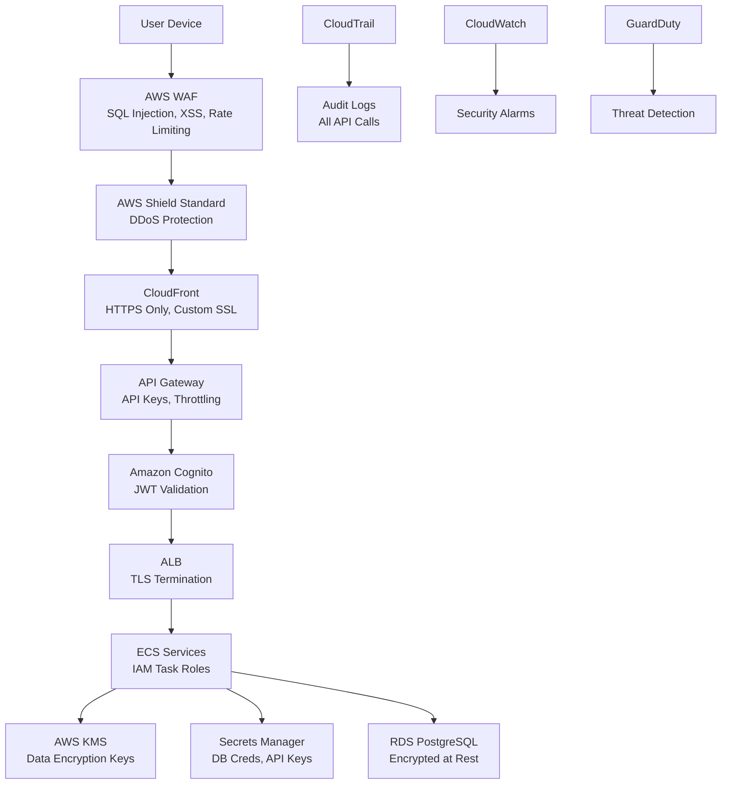

### 11.1 Security Layers (Defense in Depth)

```
Layer 1: Edge Security
  ├── CloudFront: HTTPS enforcement, TLS 1.2+
  ├── AWS WAF: Rule groups for OWASP Top 10
  ├── AWS Shield: DDoS protection (Standard)
  └── Rate limiting: Per-IP and per-user

Layer 2: Authentication & Authorization
  ├── Amazon Cognito: User pool, identity pool
  ├── JWT tokens: Access + Refresh tokens
  ├── RBAC: Owner, Accountant roles
  ├── MFA: Optional TOTP/SMS
  └── OAuth: Google, Microsoft providers

Layer 3: Network Security
  ├── VPC: Network isolation
  ├── Private subnets: No direct internet access for data
  ├── Security Groups: Least-privilege port access
  ├── NACLs: Subnet-level firewall
  └── VPC Endpoints: Private AWS service access

Layer 4: Application Security
  ├── IAM Task Roles: Per-service permissions
  ├── Input validation: API Gateway request validation
  ├── CORS: Whitelisted origins only
  ├── Content Security Policy: XSS prevention
  └── Dependency scanning: Container image scanning (ECR)

Layer 5: Data Security
  ├── KMS: AES-256 encryption at rest
  ├── TLS: Encryption in transit (all connections)
  ├── RDS: Encrypted storage + connections
  ├── S3: SSE-KMS default encryption
  ├── Secrets Manager: No hardcoded credentials
  └── RLS: Row-level security (tenant isolation)

Layer 6: Monitoring & Audit
  ├── CloudTrail: All AWS API call logging
  ├── CloudWatch Logs: Application log centralization
  ├── GuardDuty: Threat detection (optional)
  ├── Security Hub: Compliance dashboard (optional)
  └── Config: Configuration compliance tracking
```

### 11.2 IAM Role Design

```
IAM Roles (Least Privilege):
═══════════════════════════

ECS Task Role - Auth Service:
  ├── cognito-idp:AdminInitiateAuth
  ├── cognito-idp:AdminCreateUser
  ├── cognito-idp:AdminGetUser
  └── kms:Decrypt (for user data)

ECS Task Role - Document Service:
  ├── s3:PutObject, s3:GetObject (documents bucket)
  ├── textract:AnalyzeExpense
  ├── sqs:SendMessage, sqs:ReceiveMessage
  ├── bedrock:InvokeModel
  └── kms:GenerateDataKey

ECS Task Role - Ledger Service:
  ├── rds-data:ExecuteStatement (via RDS Proxy)
  ├── events:PutEvents (EventBridge)
  └── kms:Decrypt

ECS Task Role - Tax Engine:
  ├── rds-data:ExecuteStatement
  ├── elasticache:* (Redis operations)
  ├── events:PutEvents
  └── execute-api:ManageConnections (WebSocket)

ECS Task Role - AI Copilot:
  ├── bedrock:InvokeModel
  ├── es:ESHttpGet, es:ESHttpPost (OpenSearch)
  ├── rds-data:ExecuteStatement
  └── elasticache:* (session cache)

ECS Task Role - Analytics Service:
  ├── rds-data:ExecuteStatement (read-only)
  ├── elasticache:* (cache reads)
  └── s3:PutObject (export bucket)
```

### 11.3 Data Encryption Matrix

| Data Type | In Transit | At Rest | Key Management |
|-----------|:----------:|:-------:|:-------------:|
| User credentials | TLS 1.2+ | Cognito managed | AWS managed |
| Financial records (RDS) | TLS 1.2+ | AES-256 (KMS) | CMK |
| Documents (S3) | TLS 1.2+ | SSE-KMS | CMK |
| Vector embeddings (OS) | TLS 1.2+ | AES-256 (KMS) | CMK |
| Cache data (Redis) | TLS 1.2+ | AES-256 (KMS) | CMK |
| API traffic | TLS 1.2+ | N/A | ACM |
| Secrets | TLS 1.2+ | AES-256 | Secrets Manager |

---

## 12. Async Processing & Workflow Orchestration

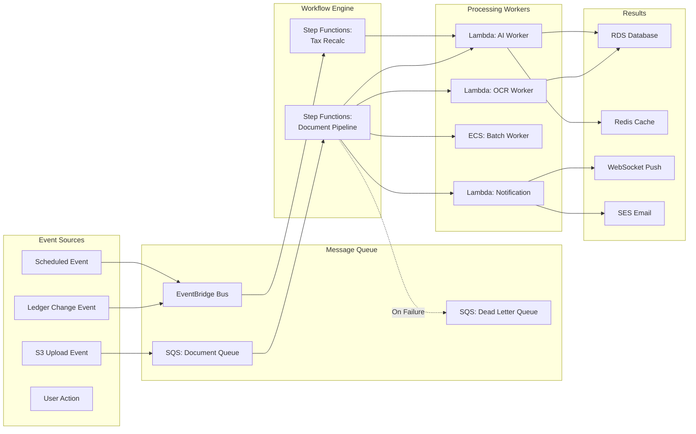

### 12.1 Event Catalog

| Event | Source | Target | Pattern |
|-------|--------|--------|---------|
| `document.uploaded` | S3 → SQS | Step Functions | Queue-based |
| `document.processed` | Step Functions | EventBridge | Event bus |
| `document.failed` | Step Functions | SQS DLQ | Dead letter |
| `ledger.entry.created` | Ledger Service | EventBridge | Event bus |
| `ledger.entry.updated` | Ledger Service | EventBridge | Event bus |
| `tax.recalculated` | Tax Engine | EventBridge → WebSocket | Push |
| `alert.tax.threshold` | Tax Engine | SQS → Lambda → SES | Queue-based |
| `report.scheduled` | EventBridge (cron) | Lambda | Scheduled |
| `user.signup` | Auth Service | EventBridge | Event bus |

### 12.2 Step Functions Workflow Definition

```json
{
  "Comment": "Document Processing Pipeline",
  "StartAt": "ValidateDocument",
  "States": {
    "ValidateDocument": {
      "Type": "Task",
      "Resource": "arn:aws:lambda:ap-south-1:ACCOUNT:function:validate-doc",
      "Next": "ExtractOCR",
      "Catch": [{ "ErrorEquals": ["ValidationError"], "Next": "NotifyFailure" }]
    },
    "ExtractOCR": {
      "Type": "Task",
      "Resource": "arn:aws:states:::textract:analyzeExpense",
      "Next": "WaitForTextract",
      "Retry": [{ "ErrorEquals": ["ThrottlingException"], "MaxAttempts": 3 }]
    },
    "WaitForTextract": {
      "Type": "Wait",
      "Seconds": 5,
      "Next": "StructureWithAI"
    },
    "StructureWithAI": {
      "Type": "Task",
      "Resource": "arn:aws:lambda:ap-south-1:ACCOUNT:function:ai-structure",
      "Next": "CheckDuplicate"
    },
    "CheckDuplicate": {
      "Type": "Choice",
      "Choices": [
        { "Variable": "$.isDuplicate", "BooleanEquals": true, "Next": "NotifyDuplicate" }
      ],
      "Default": "CreateLedgerEntry"
    },
    "CreateLedgerEntry": {
      "Type": "Task",
      "Resource": "arn:aws:lambda:ap-south-1:ACCOUNT:function:create-ledger",
      "Next": "ParallelPostProcessing"
    },
    "ParallelPostProcessing": {
      "Type": "Parallel",
      "Branches": [
        { "StartAt": "IndexEmbeddings", "States": { "IndexEmbeddings": { "Type": "Task", "Resource": "...", "End": true }}},
        { "StartAt": "TriggerTaxRecalc", "States": { "TriggerTaxRecalc": { "Type": "Task", "Resource": "...", "End": true }}},
        { "StartAt": "NotifySuccess", "States": { "NotifySuccess": { "Type": "Task", "Resource": "...", "End": true }}}
      ],
      "End": true
    },
    "NotifyFailure": { "Type": "Task", "Resource": "...", "End": true },
    "NotifyDuplicate": { "Type": "Task", "Resource": "...", "End": true }
  }
}
```

---

## 13. DevOps & CI/CD Architecture

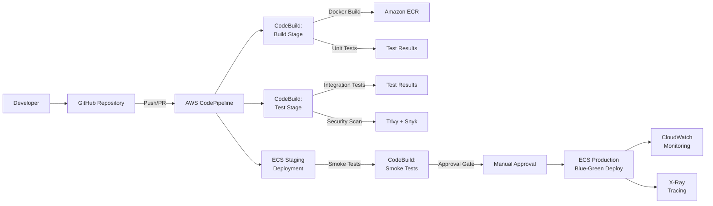

### 13.1 CI/CD Pipeline Stages

```
Pipeline: taxodo-{service}-pipeline
══════════════════════════════════

Stage 1: Source
  ├── Provider: GitHub (via CodeStar Connection)
  ├── Branch: main (production), develop (staging)
  ├── Trigger: Push to branch, PR merge
  └── Artifacts: Source code bundle

Stage 2: Build
  ├── Provider: CodeBuild
  ├── Runtime: aws/codebuild/amazonlinux2-x86_64-standard:5.0
  ├── Actions:
  │   ├── Install dependencies
  │   ├── Run linting (flake8, black)
  │   ├── Run unit tests (pytest)
  │   ├── Build Docker image
  │   ├── Security scan (Trivy)
  │   └── Push to ECR
  └── Artifacts: Docker image tag, test reports

Stage 3: Test
  ├── Provider: CodeBuild
  ├── Actions:
  │   ├── Deploy to test environment
  │   ├── Run integration tests
  │   ├── Run API contract tests
  │   └── Generate coverage report
  └── Gate: All tests passing

Stage 4: Deploy Staging
  ├── Provider: ECS Deploy
  ├── Strategy: Rolling update
  ├── Actions:
  │   ├── Update ECS task definition
  │   ├── Deploy to staging cluster
  │   └── Run smoke tests
  └── Gate: Smoke tests passing

Stage 5: Deploy Production
  ├── Provider: ECS Deploy (CodeDeploy)
  ├── Strategy: Blue-Green deployment
  ├── Approval: Manual approval gate
  ├── Actions:
  │   ├── Create new task set (green)
  │   ├── Route 10% traffic → canary
  │   ├── Monitor for 10 minutes
  │   ├── Route 100% traffic
  │   └── Terminate old task set (blue)
  └── Rollback: Automatic on health check failure
```

### 13.2 Infrastructure as Code

```
IaC Strategy: AWS CDK (TypeScript) or Terraform
═══════════════════════════════════════════════

Repository Structure:
infra/
├── cdk/
│   ├── bin/
│   │   └── app.ts                    # CDK app entry
│   ├── lib/
│   │   ├── vpc-stack.ts              # VPC, subnets, NAT
│   │   ├── data-stack.ts             # RDS, Redis, OpenSearch
│   │   ├── compute-stack.ts          # ECS, ALB, auto-scaling
│   │   ├── storage-stack.ts          # S3 buckets
│   │   ├── security-stack.ts         # Cognito, KMS, WAF
│   │   ├── messaging-stack.ts        # SQS, EventBridge, SNS
│   │   ├── ai-stack.ts              # Bedrock, Textract config
│   │   ├── monitoring-stack.ts       # CloudWatch, X-Ray
│   │   └── pipeline-stack.ts         # CodePipeline, CodeBuild
│   └── package.json
├── environments/
│   ├── dev.env
│   ├── staging.env
│   └── prod.env
└── README.md

Environment Parity:
  dev     → Minimal resources, single-AZ
  staging → Production-like, multi-AZ, smaller instances
  prod    → Full resources, multi-AZ, production instances
```

### 13.3 Container Strategy

```
Docker Images:
══════════════

Base Image: python:3.12-slim-bookworm
Multi-stage Build:
  Stage 1 (builder): Install dependencies, compile
  Stage 2 (runtime): Copy artifacts, minimal runtime

ECR Repositories:
  - taxodo/auth-service
  - taxodo/document-service
  - taxodo/ledger-service
  - taxodo/tax-engine
  - taxodo/ai-copilot
  - taxodo/analytics-service

Image Scanning: Enabled (ECR native)
Lifecycle Policy: Keep last 10 images per service
Tagging: git-{commit_sha}, latest, v{semver}
```

---

## 14. Scalability & Performance Strategy

### 14.1 Auto-Scaling Configuration

| Component | Metric | Scale Out | Scale In | Min | Max |
|-----------|--------|:---------:|:--------:|:---:|:---:|
| ECS Auth | CPU > 70% | +2 tasks | CPU < 30% | 2 | 8 |
| ECS Document | SQS queue > 100 | +5 tasks | Queue = 0 | 2 | 20 |
| ECS Ledger | CPU > 70% | +2 tasks | CPU < 30% | 2 | 10 |
| ECS Tax | CPU > 70% | +2 tasks | CPU < 30% | 2 | 10 |
| ECS AI Copilot | Request count / target | +3 tasks | Low traffic | 2 | 15 |
| ECS Analytics | CPU > 70% | +2 tasks | CPU < 30% | 2 | 8 |
| RDS | Connection count | Read replica | N/A | 1 Primary | 1 Primary + 2 Read |

### 14.2 Caching Strategy

```
Cache Hierarchy:
════════════════

Level 1: CloudFront Edge Cache
  ├── Static assets: 1 year TTL
  ├── API responses: No cache
  └── Hit ratio target: > 95% for static

Level 2: API Gateway Cache (Optional)
  ├── GET endpoints: 60 second TTL
  ├── Per-key: API key + path
  └── Invalidation: On data change

Level 3: ElastiCache Redis
  ├── Tax calculations: 5 min TTL
  ├── Dashboard KPIs: 1 min TTL
  ├── Session data: 30 min TTL
  ├── AI conversation: 1 hour TTL
  └── Hit ratio target: > 80%

Level 4: Application-Level Cache
  ├── Tax rate tables: In-memory (startup load)
  ├── HSN code mappings: In-memory
  └── Refresh: Daily or on config change
```

### 14.3 Performance Optimization Techniques

| Technique | Implementation | Impact |
|-----------|---------------|--------|
| **Connection Pooling** | RDS Proxy / PgBouncer | Reduce DB connection overhead |
| **Query Optimization** | Indexed queries, query plans | Faster DB reads |
| **Materialized Views** | Pre-computed summaries | Fast dashboard renders |
| **Async Processing** | SQS + Lambda/ECS | Non-blocking document processing |
| **CDN Caching** | CloudFront edge | Global low-latency static delivery |
| **Data Compression** | Brotli/gzip on CloudFront | Smaller payloads |
| **Lazy Loading** | Frontend code splitting | Faster initial load |
| **Pre-signed URLs** | Direct S3 upload | Bypass API server for files |
| **Batch Operations** | Bulk inserts, batch Textract | Higher throughput |
| **Read Replicas** | RDS read replicas (future) | Distribute read load |

---

## 15. Multi-Tenant SaaS Design

### 15.1 Tenancy Model

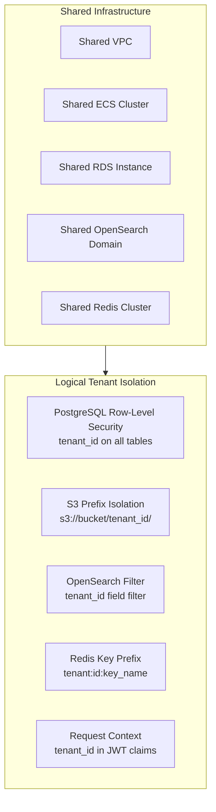

### 15.2 Tenant Isolation Matrix

| Resource | Isolation Method | Enforcement Point |
|----------|-----------------|-------------------|
| **Database Records** | Row-Level Security (tenant_id) | PostgreSQL RLS policy |
| **S3 Documents** | Prefix-based partition | IAM + application logic |
| **OpenSearch Data** | Filter query (tenant_id) | Application middleware |
| **Redis Cache** | Key prefix (tenant:{id}:) | Application middleware |
| **API Access** | JWT claim (tenant_id) | API Gateway + middleware |
| **AI Context** | Tenant-scoped RAG queries | OpenSearch filter |

### 15.3 Tenant Onboarding Flow

```
1. User signs up → Cognito user created
2. New tenant record in RDS (tenants table)
3. S3 prefix created: s3://docs/{tenant_id}/
4. RLS policy auto-applies (tenant_id column)
5. Default tax configuration set (India GST/IT)
6. Welcome email sent (SES)
7. Onboarding wizard initiated in dashboard
```

### 15.4 Tenant Data Model

```sql
-- Tenant table
CREATE TABLE tenants (
    tenant_id UUID PRIMARY KEY DEFAULT gen_random_uuid(),
    business_name VARCHAR(255) NOT NULL,
    gstin VARCHAR(15),
    pan VARCHAR(10),
    business_type VARCHAR(50),  -- proprietorship, partnership, pvt_ltd
    state_code VARCHAR(2),      -- GST state code
    registration_date DATE,
    plan_tier VARCHAR(20) DEFAULT 'free',  -- free, basic, pro
    is_active BOOLEAN DEFAULT true,
    created_at TIMESTAMPTZ DEFAULT NOW(),
    updated_at TIMESTAMPTZ DEFAULT NOW()
);

-- RLS Policy
ALTER TABLE ledger_entries ENABLE ROW LEVEL SECURITY;
CREATE POLICY tenant_isolation ON ledger_entries
    USING (tenant_id = current_setting('app.tenant_id')::uuid);
```

---

## 16. Observability & Monitoring

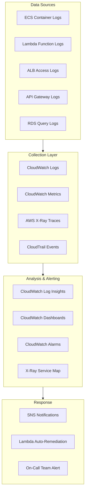

### 16.1 Monitoring Dashboard

```
CloudWatch Dashboard: "Taxodo-Production"
══════════════════════════════════════════

Row 1: System Health
  ├── ECS Service Health (all 6 services)
  ├── RDS Connection Count & CPU
  ├── Redis Memory Usage & Hit Rate
  └── OpenSearch Cluster Health

Row 2: API Performance
  ├── API Gateway Request Count (1 min)
  ├── API Latency (P50, P95, P99)
  ├── Error Rate (4xx, 5xx)
  └── Active WebSocket Connections

Row 3: Business Metrics
  ├── Documents Processed / Hour
  ├── AI Queries / Hour
  ├── Active Users (Real-time)
  └── Tax Calculations / Hour

Row 4: AI/ML Metrics
  ├── Bedrock Invocation Count
  ├── Bedrock Latency (P95)
  ├── OCR Accuracy (Custom Metric)
  └── RAG Context Retrieval Score
```

### 16.2 Alert Definitions

| Alert | Condition | Severity | Action |
|-------|-----------|:--------:|--------|
| API Error Spike | 5xx rate > 5% for 5 min | Critical | Page on-call |
| High Latency | P95 > 2s for 10 min | Warning | Slack notification |
| RDS CPU High | CPU > 85% for 15 min | Warning | Scale investigation |
| SQS Queue Depth | > 5000 messages for 10 min | Warning | Scale workers |
| DLQ Messages | > 0 messages | Warning | Investigate failures |
| Redis Memory | > 80% used | Warning | Memory review |
| Bedrock Throttling | ThrottleCount > 0 | Warning | Request limit review |
| ECS Task Failures | > 3 failures in 10 min | Critical | Service investigation |
| Certificate Expiry | < 30 days to expiry | Info | Renew certificate |

### 16.3 Distributed Tracing (X-Ray)

```
Trace Flow Example (Document Upload):
══════════════════════════════════════

Trace ID: 1-abc123-def456
Total Duration: 28.5s

├── API Gateway (42ms)
│   └── Auth: Cognito validation (15ms)
├── Document Service (85ms)
│   ├── Generate pre-signed URL (30ms)
│   └── SQS: Send message (12ms)
├── Step Functions (27.8s)
│   ├── Lambda: Validate (200ms)
│   ├── Textract: AnalyzeExpense (18.2s)
│   ├── Lambda: AI Structure (4.5s)
│   │   └── Bedrock: InvokeModel (3.8s)
│   ├── Lambda: Create Ledger (350ms)
│   │   └── RDS: INSERT (45ms)
│   └── Parallel Post-Processing (4.5s)
│       ├── OpenSearch: Index (1.2s)
│       ├── EventBridge: Put Event (50ms)
│       └── WebSocket: Notify (200ms)
└── Total Segments: 14
```

---

## 17. Database Schema Design

### 17.1 Entity Relationship Diagram

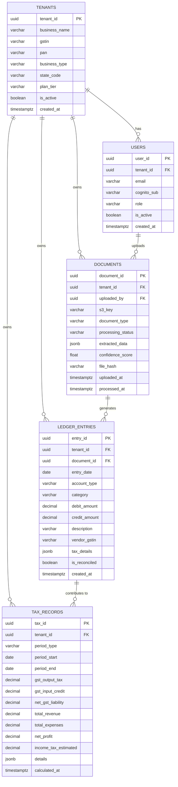

### 17.2 Key Indexes

```sql
-- Performance-critical indexes
CREATE INDEX idx_ledger_tenant_date ON ledger_entries(tenant_id, entry_date DESC);
CREATE INDEX idx_ledger_tenant_category ON ledger_entries(tenant_id, category);
CREATE INDEX idx_ledger_tenant_vendor ON ledger_entries(tenant_id, vendor_gstin);
CREATE INDEX idx_documents_tenant_status ON documents(tenant_id, processing_status);
CREATE INDEX idx_documents_file_hash ON documents(file_hash);  -- Duplicate detection
CREATE INDEX idx_tax_tenant_period ON tax_records(tenant_id, period_start, period_end);
CREATE INDEX idx_users_cognito_sub ON users(cognito_sub);

-- GIN index for JSONB queries
CREATE INDEX idx_ledger_tax_details ON ledger_entries USING GIN (tax_details);
CREATE INDEX idx_documents_extracted ON documents USING GIN (extracted_data);
```

---

## 18. API Gateway Design

### 18.1 API Structure

```
API Base URL: https://api.taxodo.ai/v1

Authentication Endpoints:
  POST   /auth/signup          → User registration
  POST   /auth/login           → User login (returns JWT)
  POST   /auth/refresh         → Refresh access token
  POST   /auth/logout          → Invalidate session
  POST   /auth/forgot-password → Password reset flow

Document Endpoints:
  POST   /documents/upload-url → Get pre-signed upload URL
  POST   /documents/upload     → Confirm upload, trigger processing
  GET    /documents            → List documents (paginated)
  GET    /documents/{id}       → Get document details
  GET    /documents/{id}/status → Processing status
  DELETE /documents/{id}       → Delete document
  POST   /documents/bulk       → Bulk upload initiation

Ledger Endpoints:
  GET    /ledger/entries       → List entries (filtered, paginated)
  POST   /ledger/entries       → Manual entry creation
  PUT    /ledger/entries/{id}  → Update entry
  DELETE /ledger/entries/{id}  → Delete entry
  GET    /ledger/summary       → Financial summary (period)
  GET    /ledger/export        → Export to CSV/PDF

Tax Endpoints:
  GET    /tax/gst/summary      → Current GST liability
  GET    /tax/gst/itc          → ITC breakdown
  GET    /tax/income/estimate  → Income tax projection
  POST   /tax/simulate        → Scenario simulation
  GET    /tax/regime-compare   → Old vs New regime comparison
  GET    /tax/advance-tax      → Advance tax schedule

AI Copilot Endpoints:
  POST   /copilot/query        → Send query to AI
  GET    /copilot/history      → Conversation history
  DELETE /copilot/history      → Clear conversation

Analytics Endpoints:
  GET    /analytics/pnl        → P&L data (period)
  GET    /analytics/cashflow   → Cash flow data
  GET    /analytics/expenses   → Expense breakdown
  GET    /analytics/kpis       → Dashboard KPIs
  GET    /analytics/trends     → Financial trends
```

### 18.2 API Response Standards

```json
// Success Response
{
  "success": true,
  "data": { ... },
  "meta": {
    "page": 1,
    "per_page": 20,
    "total": 150,
    "next_cursor": "abc123"
  }
}

// Error Response
{
  "success": false,
  "error": {
    "code": "DOCUMENT_NOT_FOUND",
    "message": "The requested document does not exist.",
    "details": { "document_id": "uuid-here" }
  }
}
```

---

## 19. AI/ML Pipeline Design

### 19.1 Document AI Pipeline

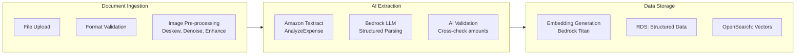

### 19.2 RAG Retrieval Pipeline

```
Query Processing:
═════════════════

1. Intent Classification
   ├── Factual: "What was my revenue last month?"
   ├── Analytical: "Why are expenses increasing?"
   ├── Advisory: "Should I hire another employee?"
   └── Informational: "What is Section 44AD?"

2. Query Expansion
   ├── Synonym expansion (revenue → sales, income)
   ├── Date range resolution ("last month" → 2026-01-01 to 2026-01-31)
   └── Entity extraction (amounts, vendors, categories)

3. Retrieval Strategy (per intent)
   ├── Factual → SQL query (primary), Vector search (supporting)
   ├── Analytical → SQL aggregation + Vector search (context)
   ├── Advisory → Vector search (similar scenarios) + SQL (current data)
   └── Informational → Vector search (knowledge base)

4. Context Ranking
   ├── Relevance score (cosine similarity for vectors)
   ├── Recency score (newer data weighted higher)
   ├── Source diversity (mix SQL + vector results)
   └── Token budget allocation (max 3000 tokens context)
```

### 19.3 Model Configuration

```
Amazon Bedrock Models Used:
═══════════════════════════

1. Claude 3.5 Sonnet (Primary LLM)
   ├── Use: Financial Q&A, advisory, document structuring
   ├── Temperature: 0.3 (factual)
   ├── Max Tokens: 1024 (response), 4096 (context)
   ├── Guardrails: Financial safety, no investment advice
   └── Cost: ~$3/1M input tokens, ~$15/1M output tokens

2. Titan Text Embeddings v2
   ├── Use: Document and query embedding
   ├── Dimensions: 1024
   ├── Normalize: True
   └── Cost: ~$0.02/1M tokens

3. Titan Text (Fallback LLM)
   ├── Use: Fallback when Claude unavailable
   ├── Temperature: 0.3
   └── Cost: Lower than Claude

Bedrock Guardrails:
  ├── Blocked topics: Investment advice, specific stock recommendations
  ├── Sensitive info filter: PII detection and masking
  ├── Content filter: Profanity, harmful content
  └── Word policy: Financial disclaimer on advisory responses
```

---

## 20. Disaster Recovery & Business Continuity

### 20.1 DR Strategy

```
DR Tier: Warm Standby (for critical services)
═══════════════════════════════════════════════

RTO (Recovery Time Objective): < 1 hour
RPO (Recovery Point Objective): < 5 minutes

Component Recovery:
┌──────────────────┬─────────────┬──────────────┬─────────────┐
│ Component        │ RPO         │ RTO          │ Strategy    │
├──────────────────┼─────────────┼──────────────┼─────────────┤
│ RDS PostgreSQL   │ 5 minutes   │ < 30 min     │ Multi-AZ +  │
│                  │ (PITR)      │ (auto-failover)│ Snapshots  │
├──────────────────┼─────────────┼──────────────┼─────────────┤
│ S3 Documents     │ 0 (real-time)│ 0           │ 11 9s       │
│                  │             │              │ durability  │
├──────────────────┼─────────────┼──────────────┼─────────────┤
│ ECS Services     │ N/A         │ < 5 min      │ Multi-AZ    │
│                  │ (stateless) │ (auto-replace)│ auto-scaling│
├──────────────────┼─────────────┼──────────────┼─────────────┤
│ ElastiCache      │ N/A (cache) │ < 5 min      │ Multi-AZ    │
│                  │             │ (auto-failover)│ replica    │
├──────────────────┼─────────────┼──────────────┼─────────────┤
│ OpenSearch       │ Daily       │ < 1 hour     │ Snapshots + │
│                  │ snapshot    │ (restore)    │ rebuild     │
└──────────────────┴─────────────┴──────────────┴─────────────┘
```

### 20.2 Backup Schedule

| Data Store | Method | Frequency | Retention | Cross-Region |
|------------|--------|:---------:|:---------:|:------------:|
| RDS | Automated snapshots | Daily | 30 days | Optional |
| RDS | PITR | Continuous | 7 days | N/A |
| S3 | Versioning | Real-time | Indefinite | Optional |
| OpenSearch | Snapshots | Daily | 14 days | No |
| IaC Code | Git repository | Every commit | Indefinite | GitHub (global) |
| Secrets | Secrets Manager | Managed | Managed | No |

---

## 21. Cost Architecture & Optimization

### 21.1 Estimated Monthly Cost (MVP Scale)

| Service | Configuration | Estimated Cost/Month |
|---------|--------------|:--------------------:|
| **ECS Fargate** | 6 services × 2 tasks × small | $150-250 |
| **RDS PostgreSQL** | db.r6g.large, Multi-AZ | $300-400 |
| **ElastiCache Redis** | cache.r6g.large, 1+1 | $200-300 |
| **OpenSearch** | t3.medium × 2 | $150-200 |
| **S3** | 100 GB + requests | $5-15 |
| **CloudFront** | 100 GB transfer | $10-20 |
| **API Gateway** | 1M requests | $3-5 |
| **Textract** | 10K pages/month | $15-20 |
| **Bedrock** | 500K tokens/day | $100-200 |
| **Lambda** | 1M invocations | $5-10 |
| **NAT Gateway** | 2 × data processing | $70-100 |
| **Others** | KMS, Secrets, CloudWatch | $50-80 |
| **Total** | | **$1,058-1,600** |

### 21.2 Cost Optimization Strategies

| Strategy | Savings | Implementation |
|----------|:-------:|---------------|
| **Reserved Instances** | 30-60% | RDS, ElastiCache (1-year RI) |
| **Spot Instances** | 60-90% | Batch processing ECS tasks |
| **S3 Lifecycle** | 50-70% | Move old docs to Glacier |
| **Right-sizing** | 20-30% | Monitor and adjust instance sizes |
| **Lambda vs ECS** | Variable | Use Lambda for bursty workloads |
| **Caching** | 30-50% | Reduce DB/Bedrock calls |
| **VPC Endpoints** | 50% | Reduce NAT Gateway data charges |
| **Bedrock Caching** | 30-40% | Cache common LLM responses |

---

## 22. Deployment Architecture

### 22.1 Environment Strategy

```
Environments:
═════════════

Development (dev):
  ├── Single-AZ deployment
  ├── Minimal instance sizes
  ├── Shared resources where possible
  ├── Auto-shutdown after hours (optional)
  └── Cost target: < $200/month

Staging:
  ├── Multi-AZ deployment
  ├── Production-like configuration
  ├── Smaller instance sizes (1 step down)
  ├── Full CI/CD pipeline
  └── Cost target: < $500/month

Production:
  ├── Multi-AZ deployment
  ├── Full auto-scaling
  ├── Production instance sizes
  ├── Blue-green deployment
  ├── Full monitoring & alerting
  └── Cost target: < $1,600/month
```

### 22.2 Deployment Checklist

```
Pre-Deployment:
  □ All tests passing (unit, integration, e2e)
  □ Security scan clean (no critical/high vulnerabilities)
  □ Database migrations tested on staging
  □ Rollback plan documented
  □ CloudWatch dashboards updated

Deployment:
  □ Blue-green deployment initiated
  □ Canary traffic (10%) verified
  □ Health checks passing
  □ No error rate increase
  □ Full traffic cutover
  □ Old tasks terminated

Post-Deployment:
  □ Smoke tests passing (production)
  □ Key metrics stable (latency, errors)
  □ No SQS DLQ messages
  □ Customer-facing features verified
  □ Deployment logged in runbook
```

---

## 23. Future Architecture Enhancements

### Phase 2 Enhancements (3-6 months)

| Enhancement | AWS Service | Impact |
|-------------|-------------|--------|
| **Kafka Event Streaming** | Amazon MSK | Higher throughput, event replay |
| **Mobile Native Apps** | React Native + Amplify | Better mobile experience |
| **Bank Statement Parsing** | Textract + Bedrock | Auto-reconciliation |
| **Multi-language AI** | Bedrock (Hindi support) | Wider user reach |
| **WhatsApp Bot** | API Gateway + Lambda | Document upload via WhatsApp |

### Phase 3 Enhancements (6-12 months)

| Enhancement | AWS Service | Impact |
|-------------|-------------|--------|
| **SageMaker Fine-tuned OCR** | SageMaker | 95%+ accuracy on Indian invoices |
| **Multi-region Deployment** | Global Accelerator | Lower latency across India |
| **Predictive AI Models** | SageMaker | Revenue/expense forecasting |
| **Open Banking Integration** | API Gateway + Partners | Real-time bank data |
| **Service Mesh** | App Mesh | Advanced microservice management |
| **Data Lake Analytics** | Athena + Glue | Advanced business analytics |

### Architecture Evolution Path

```
Current (Phase 1):
  ECS Fargate → REST APIs → RDS → Redis → OpenSearch

Future (Phase 2):
  + MSK (Kafka) → Event streaming
  + SageMaker → Custom OCR models
  + AppSync → GraphQL API (optional)

Future (Phase 3):
  + Global Accelerator → Multi-region
  + App Mesh → Service mesh
  + Athena + Glue → Data lake analytics
  + SageMaker → Predictive models
```

---

## 24. Architecture Decision Records (ADRs)

### ADR-001: ECS Fargate over EKS

**Decision:** Use ECS Fargate instead of EKS for container orchestration.
**Context:** Need container orchestration for 6 microservices.  
**Rationale:** ECS Fargate offers simpler operations, lower overhead, sufficient features for initial scale. EKS adds Kubernetes complexity without proportional benefit at current scale.  
**Consequences:** May need to migrate to EKS if advanced scheduling/service mesh features become critical. Can migrate gradually.

### ADR-002: PostgreSQL over DynamoDB for Financial Data

**Decision:** Use RDS PostgreSQL as primary database.  
**Context:** Financial data requires ACID transactions, complex queries, relational joins.  
**Rationale:** PostgreSQL provides strong consistency, complex query support, JSON columns, row-level security — all critical for financial applications. DynamoDB's eventual consistency and limited query patterns are unsuitable for financial data.  
**Consequences:** Need to manage RDS (via managed service), handle connection pooling. Vertical scaling limits may require read replicas.

### ADR-003: Amazon Bedrock over Self-hosted LLM

**Decision:** Use Amazon Bedrock for LLM inference.  
**Context:** Need LLM for document parsing, financial Q&A, advisory.  
**Rationale:** Managed service eliminates model hosting complexity, provides model variety (Claude, Titan), guardrails, and scales automatically. Cost-effective for initial scale.  
**Consequences:** Vendor lock-in with Bedrock, model availability depends on AWS. Can add SageMaker endpoints later for custom models.

### ADR-004: OpenSearch over Pinecone for Vector DB

**Decision:** Use Amazon OpenSearch for RAG vector storage.  
**Context:** Need vector database for semantic search in RAG pipeline.  
**Rationale:** AWS-native service, single vendor strategy, supports both vector search (k-NN) and text search, VPC-integrated, cost-effective at scale.  
**Consequences:** OpenSearch k-NN may have lower accuracy than specialized vector DBs at very large scale. Acceptable for current requirements.

### ADR-005: Event-Driven over Request-Response for Document Processing

**Decision:** Use SQS + Step Functions for document processing.  
**Context:** Document processing involves multiple steps (OCR, AI, DB writes) taking 15-30 seconds.  
**Rationale:** Synchronous processing would cause API timeouts, poor UX, and coupling. Event-driven approach provides async processing, retry logic, DLQ for failures, and workflow visibility.  
**Consequences:** Added complexity of SQS management, eventual consistency between upload and processing. Mitigated with WebSocket notifications.

---

## 25. Final Architecture Summary

Taxodo AI is architected as a **cloud-native, event-driven, AI-first SaaS platform** leveraging AWS managed services:

| Layer | Services | Purpose |
|-------|----------|---------|
| **Frontend** | S3, CloudFront, Route 53 | Global, fast, secure web delivery |
| **API** | API Gateway, ALB | Managed API with auth and rate limiting |
| **Compute** | ECS Fargate, Lambda | Scalable containerized microservices |
| **AI/ML** | Bedrock, Textract, OpenSearch | Document AI, RAG, financial advisory |
| **Data** | RDS PostgreSQL, S3, Redis | ACID financial data, documents, caching |
| **Messaging** | SQS, EventBridge, Step Functions | Async processing, event choreography |
| **Security** | Cognito, KMS, WAF, Shield | Fintech-grade authentication and encryption |
| **Observability** | CloudWatch, X-Ray, CloudTrail | Full-stack monitoring and audit |
| **CI/CD** | CodePipeline, CodeBuild, ECR | Automated build, test, deploy |

The architecture ensures **high scalability** (auto-scaling microservices), **security** (encryption everywhere, VPC isolation), **real-time financial intelligence** (event-driven tax computation, WebSocket push), and **enterprise-grade reliability** (Multi-AZ, 99.9% SLA) suitable for fintech and AI applications serving Indian SMEs.
